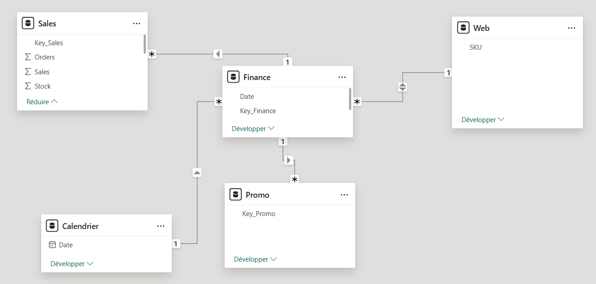
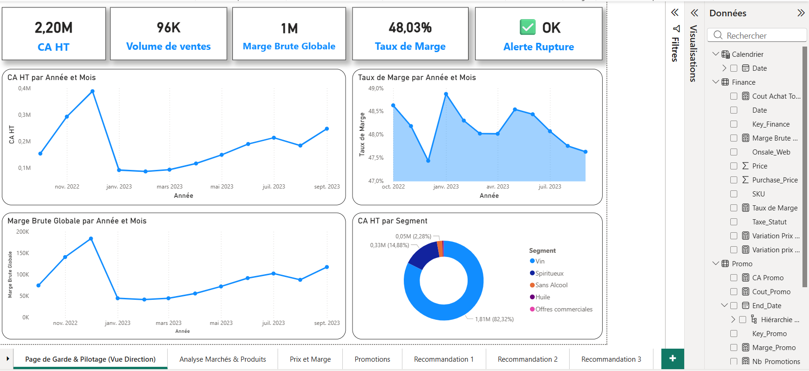
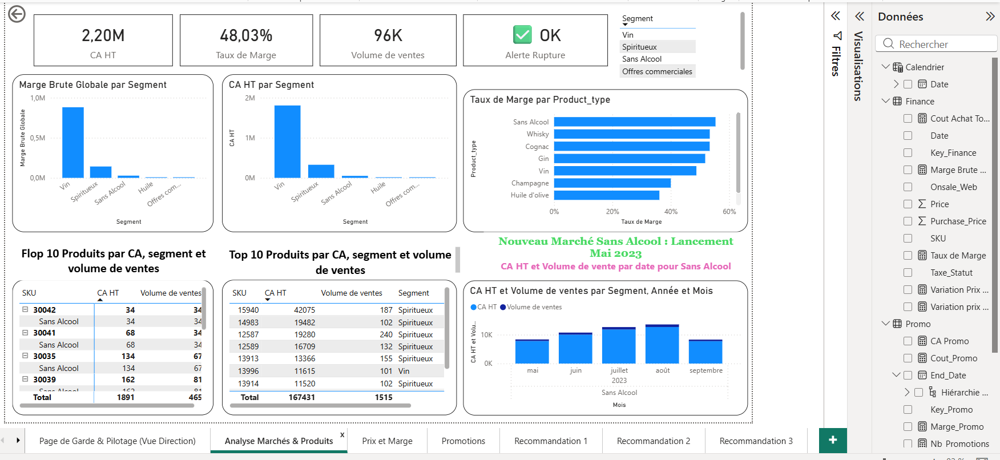
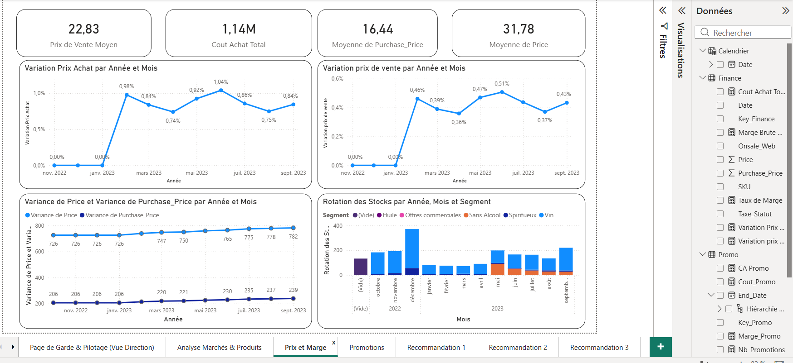
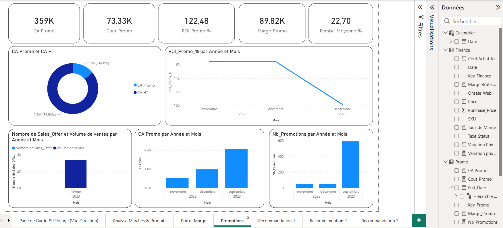
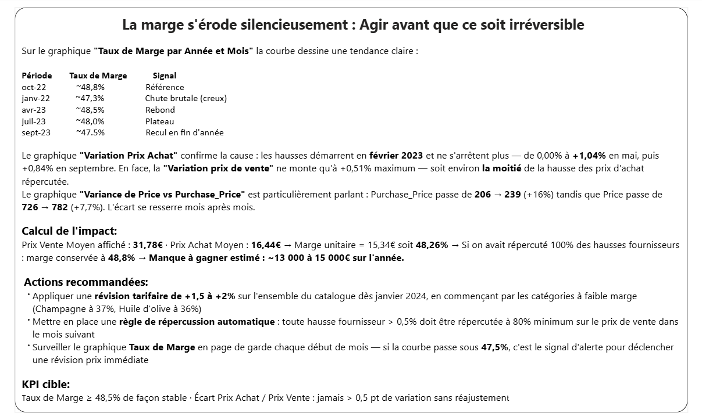
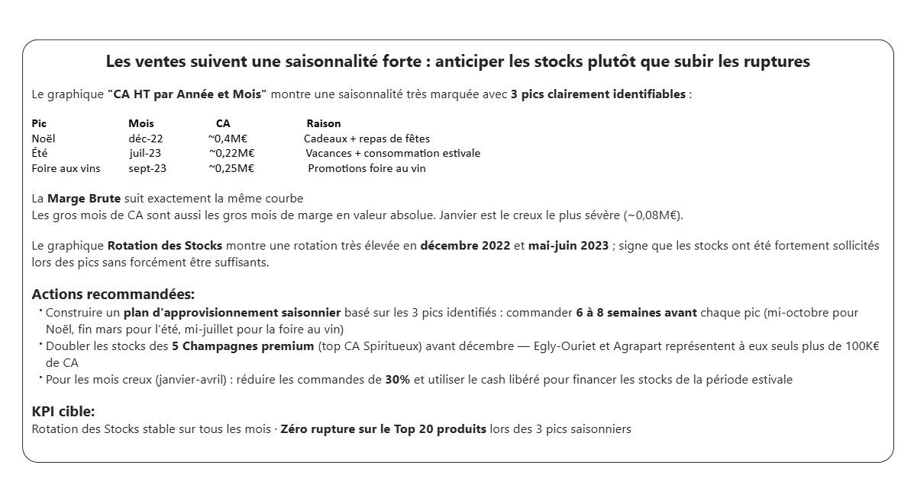
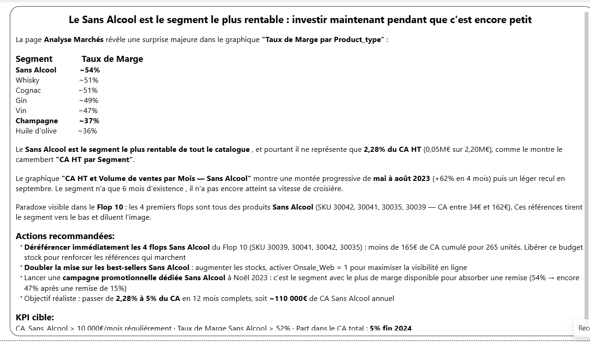
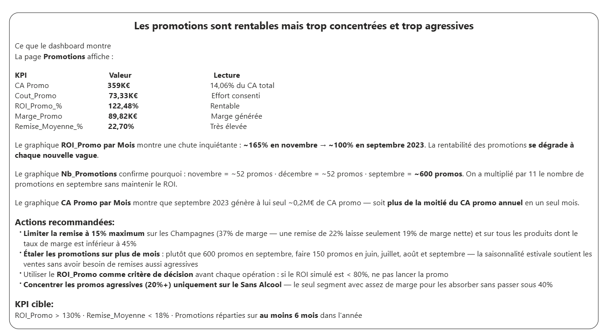

# Projet Bottleneck : Système de Pilotage de la Performance Commerciale

## 📌 Présentation du Projet
Ce projet a été réalisé pour l'entreprise **Bottleneck**, un marchand de vins et spiritueux. L'objectif était de transformer des données brutes issues de différents systèmes (E-commerce, ERP, Marketing) en un outil de pilotage stratégique centralisé. 

Le projet couvre l'intégralité du cycle de la donnée : du nettoyage initial de la base SQLite à la recommandation d'une architecture ETL robuste et la création de tableaux de bord interactifs.

Ce projet vise à évaluer et préconiser la solution technique la plus adaptée pour connecter les données de l'entreprise à un outil de data visualisation. L'enjeu est de permettre un pilotage fluide et fiable de l'activité pour la direction et les chefs de produits.
L’entreprise Bottleneck souhaite mettre à disposition de ses équipes un outil de pilotage de l’activité basé sur des données désormais centralisées, propres et fiabilisées. Les enjeux principaux concernent le suivi des marges, des prix d’achat dans un contexte inflationniste, de la performance commerciale, des stocks ainsi que des promotions.

---
## 📊 Enjeux Métiers & Objectifs
Le système de dashboarding répond à quatre enjeux critiques identifiés :
*   **Contrôle des Marges** : Suivi en temps réel des marges brutes par produit pour contrer l'impact de l'inflation sur les prix d'achat.
*   **Pilotage des Nouveaux Marchés** : Analyse spécifique du segment "Sans Alcool" en pleine croissance.
*   **Performance Promotionnelle** : Mesure du ROI des offres promotionnelles pour optimiser le budget marketing.
*   **Gestion Opérationnelle** : Mise en place d'alertes sur les niveaux de stocks et les produits à faible rotation.
---
## 🛠️ Architecture Technique
L'écosystème technique choisi garantit la fiabilité et l'évolutivité des analyses :
*   **Source de données** : Base relationnelle **SQLite** (`Bottleneck.db`) regroupant les tables *Sales*, *Finance*, *Promo*, et *Web*.
*   **ETL (Extract, Transform, Load)** : Utilisation de **Power Query** pour automatiser les jointures complexes, le typage des données et la création d'indicateurs calculés.
*   **Modélisation** : Schéma en étoile optimisé pour la Data Visualisation.
*   **Visualisation** : **Power BI** pour le reporting interactif.
---
## 📁 Structure de la Base de Données
Le modèle de données s'appuie sur quatre piliers :
1.  **Sales** : Volumes de ventes, transactions et état des stocks.
2.  **Finance** : Prix d'achat (contexte inflationniste), prix de vente HT et statut fiscal.
3.  **Web** : Données descriptives des produits, catégories (Vins, Spiritueux, Sans Alcool) et avis clients.
4.  **Promo** : Calendrier des offres, remises appliquées et types de promotions.
---
## 📈 Contenu du Dashboard Power BI
Le fichier `Kamoune_Assia_2_Tableau_032026.pbix` est structuré en plusieurs pages :
*   **Vue d'ensemble (KPIs)** : Chiffre d'affaires, Marge globale, Top/Flop 5 des ventes.
*   **Analyse Marchés** : Segmentation par type de boisson et performance régionale.
*   **Performance Promotions** : Comparaison des ventes avec et sans remise, calcul de l'incrémental.
*   **Alertes Stock & Marges** : Liste des produits sous le seuil de rentabilité ou en rupture imminente.

---

## 📝 Livrables inclus

*    [**Tableau de bord Power BI**](./Kamoune_Assia_2_Tableau_032026.pbix)
*    [**Analyse détaillée et préconisations d'architecture**](./Kamoune_Assia_1_Rapport_032026.docx)

---
## Modèle relationnel

---
## Page de Garde & Pilotage (Vue Direction)

---
## Analyse Marchés & Produits

---

## Prix et Marge

---

## Promotions 

---
## Recommandation 1

---

## Recommandation 2

---
## Recommandation 3

---

## Recommandation 4

